# Diagramas de Fluxo — TCC: Hephaestus
## Plataforma de Simulação e Controle de Manipuladores Robóticos

> **Como renderizar:** [Mermaid Live Editor](https://mermaid.live) ≥ v10.4

---

## Diagrama 1 — Arquitetura Geral do Sistema

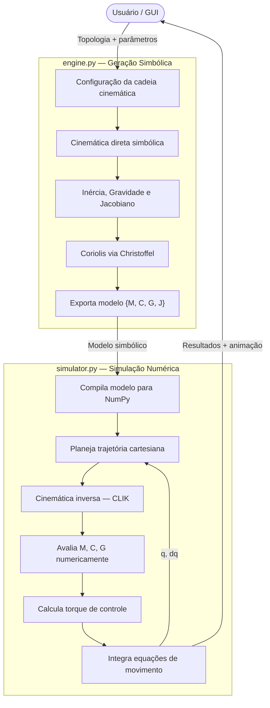

---

## Diagrama 2a — Cinemática Simbólica

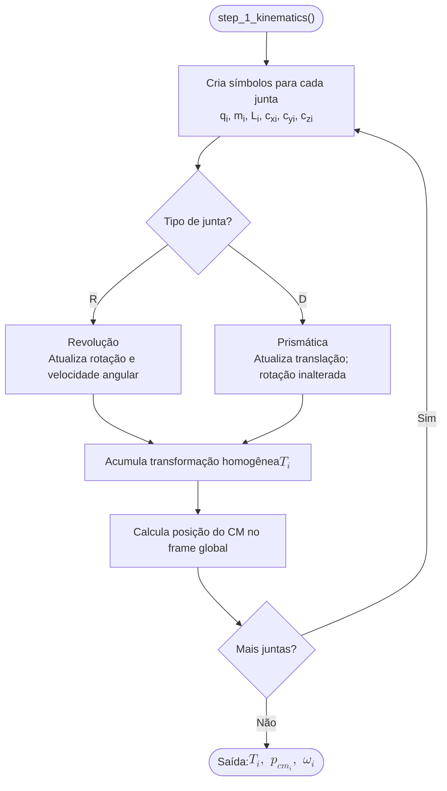

---

## Diagrama 2b — Dinâmica Simbólica: M, G e Coriolis

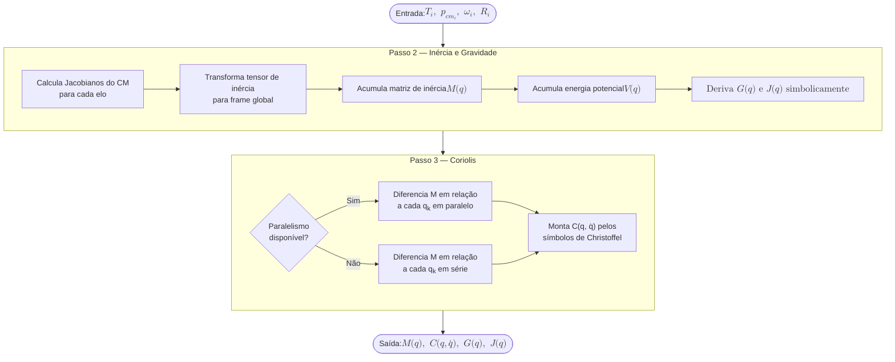

---

## Diagrama 3 — Extensão Hidrodinâmica

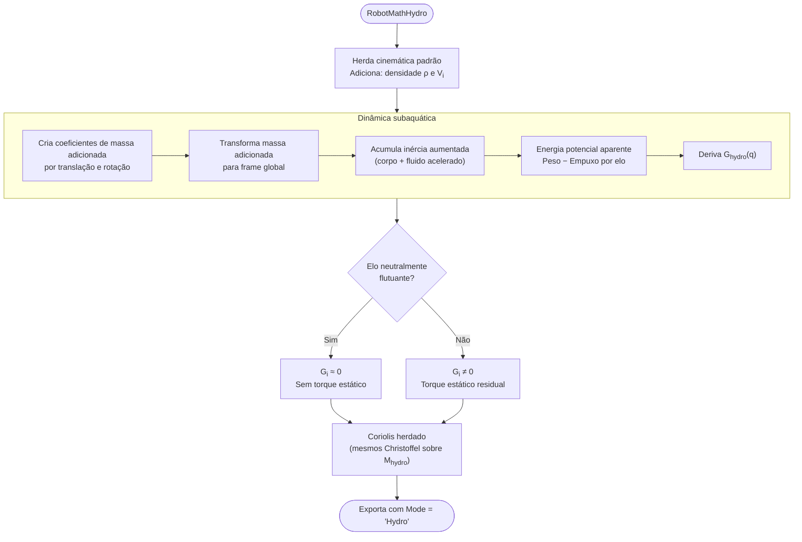

---

## Diagrama 4 — Compilação Simbólico-Numérica

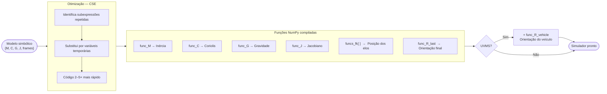

---

## Diagrama 5 — Planejamento de Trajetória

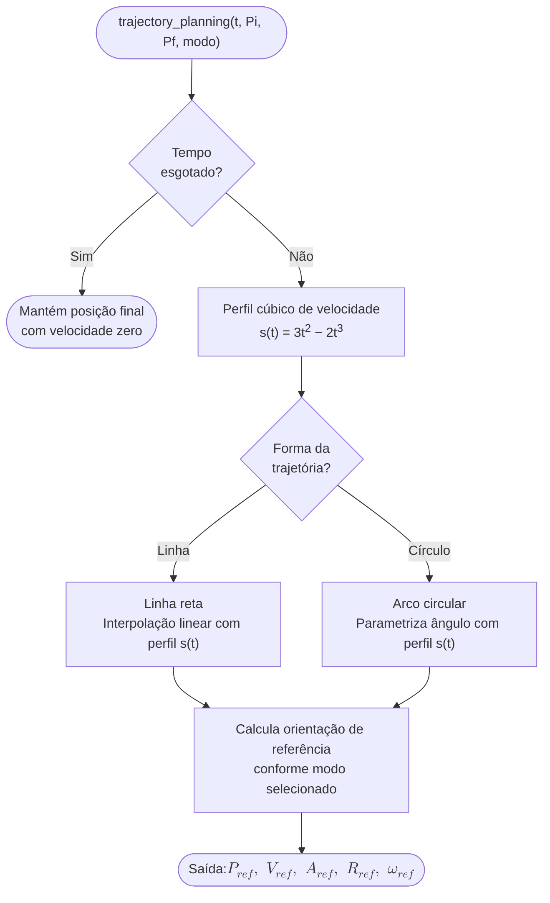

---

## Diagrama 6a — CLIK: Cinemática Inversa Numérica

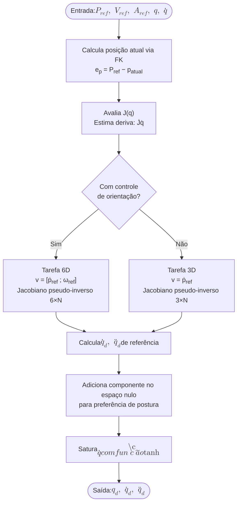

---

## Diagrama 6b — Modos de Orientação do Efetuador

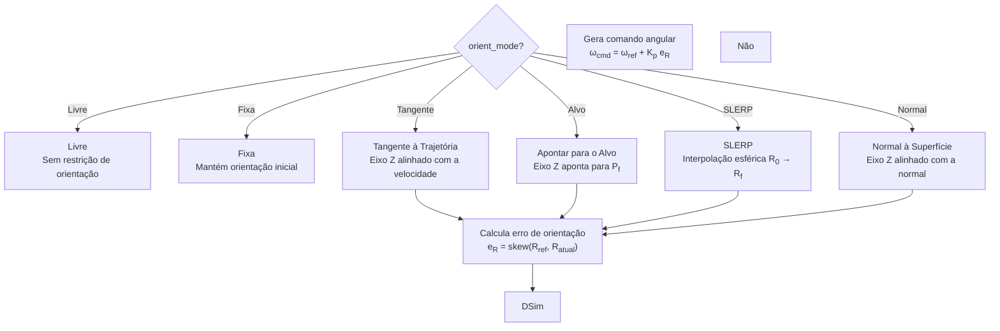

---

## Diagrama 7a — Loop de Simulação: Inicialização

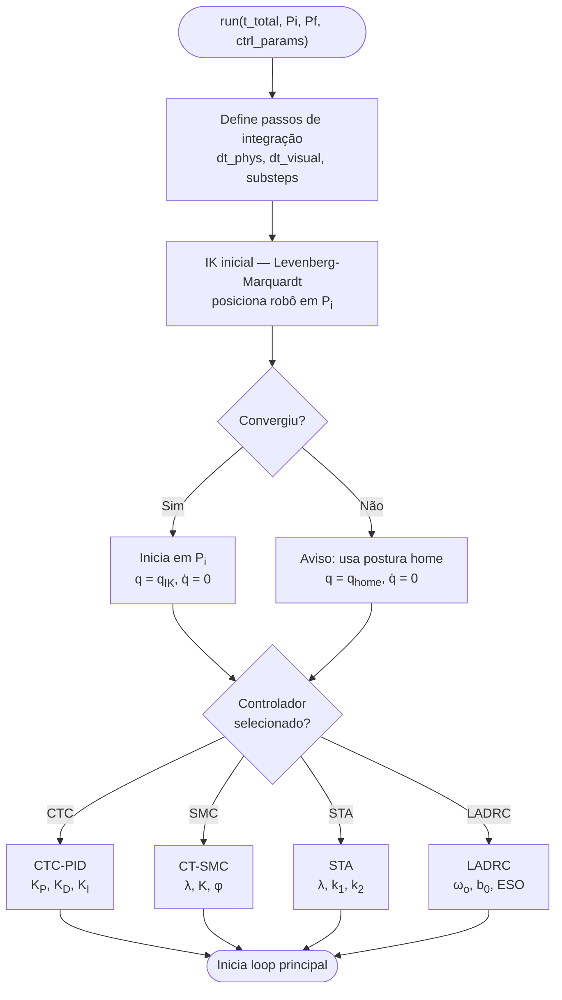

---

## Diagrama 7b — Loop de Simulação: Passo de Controle

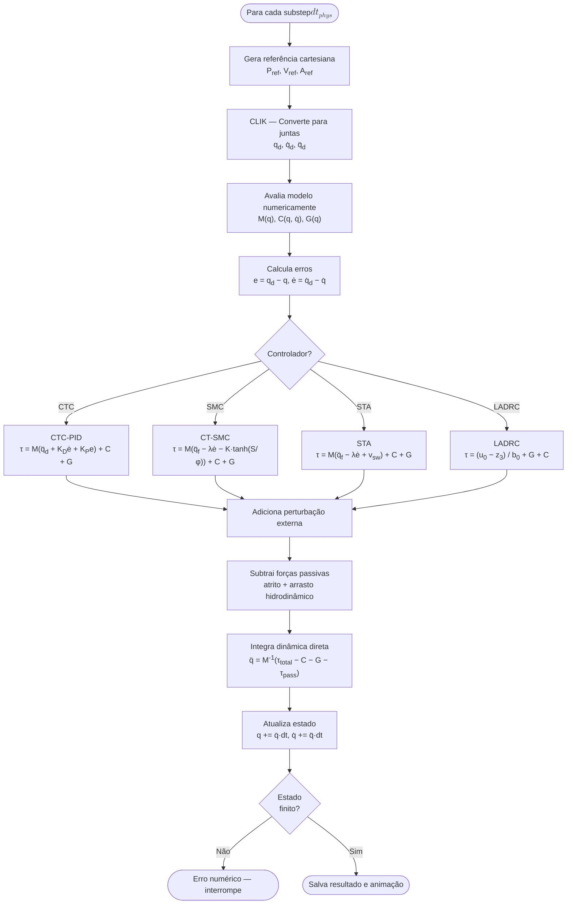

---

## Diagrama 8 — Controlador CTC-PID

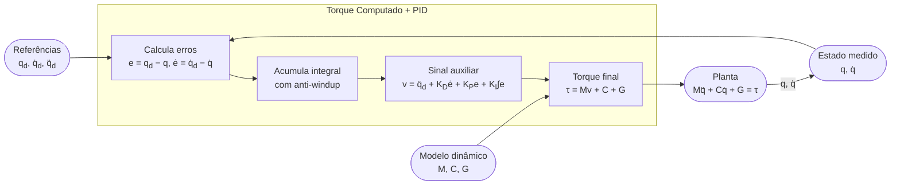

---

## Diagrama 9 — Controlador CT-SMC

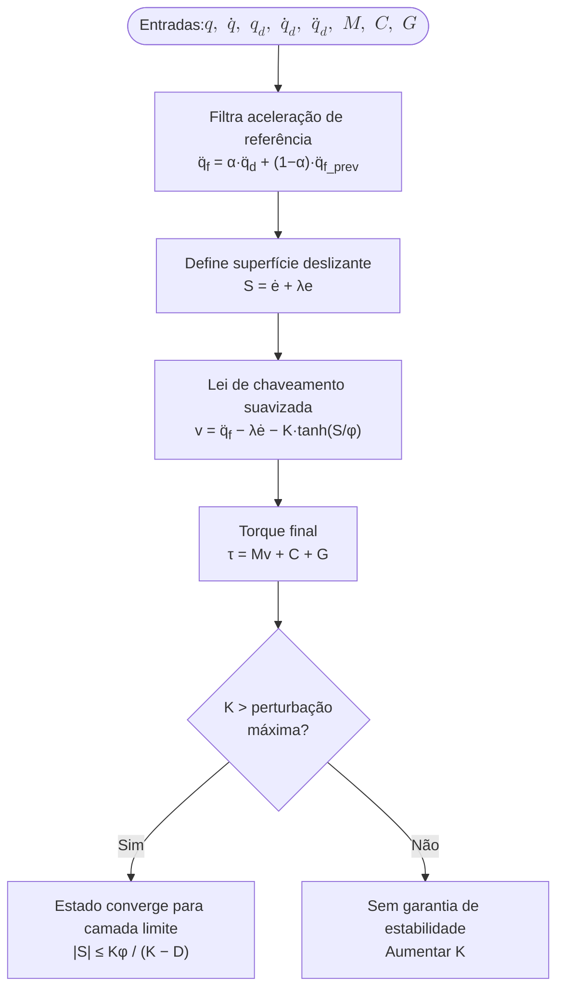

---

## Diagrama 10 — Controlador STA (Super-Twisting)

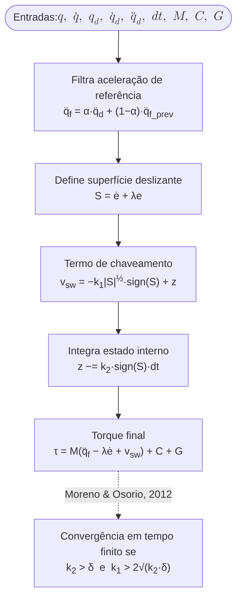

---

## Diagrama 11a — LADRC: Observador de Estado Estendido

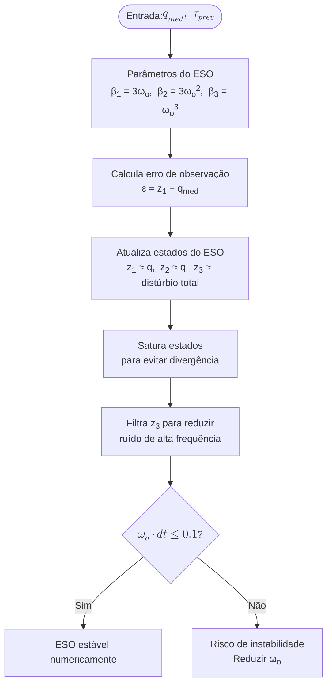

---

## Diagrama 11b — LADRC: Lei de Controle

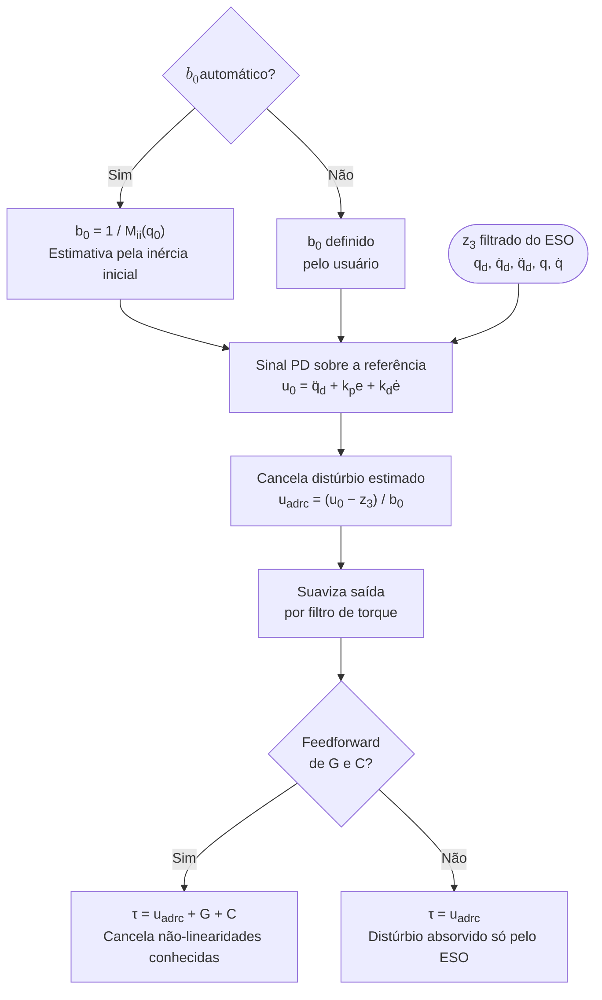

---

## Diagrama 12 — Paralelismo em Dois Níveis

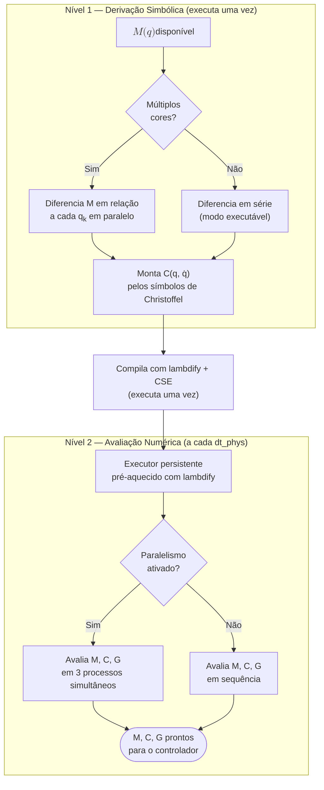

---

*Gerado a partir da análise de `engine.py`, `simulator.py` e dos capítulos do TCC — Hephaestus.*
